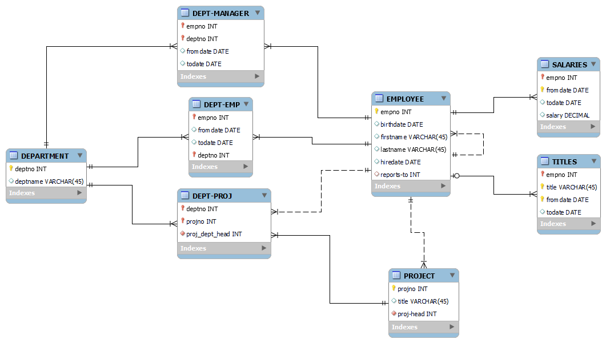

# Enterprise Database Design & Implementation (MySQL)

This repository contains the Enhanced Entity-Relationship (EER) model and SQL implementation for an enterprise database system, designed using MySQL Workbench

## Project Overview

**The database models an enterprise with:**

- Departments, Employees, and Projects
- Employee reporting hierarchy & department assignments
- Project management with department participation
- Salary history & job titles tracking

**Features & Implementation**

- EER Diagram created in MySQL Workbench
- SQL scripts for database creation & population
- Referential integrity ensured through foreign keys
- Optimized queries for data retrieval

**Technologies Used**

- MySQL
- SQL (DDL & DML)
- MySQL Workbench

<h2>About:</h2>

<b>Author: </b><a href="https://github.com/bill-chamal">Bill Chamalidis</a> University of Macedonia

